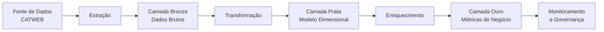

# Projeto CATWEB - Redesenho Moderno do ETL


Este é um redesenho completo do projeto original de ETL dos dados do sistema CATWEB (Comunicação de Acidentes do Trabalho do INSS), utilizando ferramentas modernas de engenharia de dados para criar um pipeline robusto, escalável e monitorável.

## Visão Geral do Projeto

O sistema CATWEB coleta informações cruciais sobre acidentes de trabalho no Brasil. Este projeto reprojeta completamente o fluxo de processamento desses dados, implementando:

1. **Pipeline Moderno**: Utilizando práticas de engenharia de dados contemporâneas
2. **Arquitetura em Camadas**: Bronze (raw), Prata (cleaned), Ouro (enriched)
3. **Governança Incorporada**: Validação e monitoramento em todas as etapas
4. **Orquestração Profissional**: Gerenciamento de dependências e falhas



## Arquitetura do Pipeline

### 1. ETL Bruto (Extração e Carga Inicial)
- **Objetivo**: Coleta confiável dos dados fonte
- **Componentes**:
  - Crawler automatizado para download de arquivos
  - Validação inicial de integridade
  - Carga em formato otimizado (Parquet/Delta)
- **Saída**: Tabelão histórico em camada Bronze

### 2. Modelagem Dimensional
- **Objetivo**: Estruturar dados em modelo analítico
- **Ferramenta Principal**: dbt (Data Build Tool)
- **Saídas**:
  - Tabela Fato: Eventos de acidentes
  - Dimensões: Tempo, Localidade, Empresa, Tipo de Acidente
- **Qualidade**: Testes de integridade e consistência

### 3. Camada Business (Ouro)
- **Objetivo**: Cálculo de métricas estratégicas
- **Processamento**:
  - Cálculo de KPIs de segurança
  - Enriquecimento com dados externos
  - Criação de visões business-friendly
- **Saída**: Tabelas "delivery" prontas para consumo

### 4. Governança e Monitoramento
- **Objetivo**: Garantir confiabilidade contínua
- **Componentes**:
  - Validação com Great Expectations
  - Linhagem de dados com OpenLineage
  - Dashboard de qualidade
  - Alertas automatizados

## Ferramentas Utilizadas

| Camada           | Ferramentas                          |
|------------------|--------------------------------------|
| **Orquestração** | Apache Airflow                       |
| **Armazenamento**| Delta Lake / S3 / GCS                |
| **Transformação**| dbt, Spark (Python/SQL)              |
| **Governança**   | Great Expectations, OpenMetadata     |
| **Visualização** | Metabase/Redash                      |
| **Infraestrutura**| Docker, Kubernetes                   |

## Estrutura de Diretórios

```
catweb-etl/
├── dags/                          # DAGs do Airflow
│   ├── extraction_dag.py          # DAG de extração
│   ├── transformation_dag.py      # DAG de modelagem
│   ├── business_layer_dag.py      # DAG de enriquecimento
│   └── governance_dag.py          # DAG de governança
├── dbt/                           # Projeto dbt
│   ├── models/
│   │   ├── staging/               # Modelos de staging
│   │   ├── marts/                 # Modelos de negócio
│   │   └── delivery/              # Camada final
│   ├── tests/                     # Testes de dados
│   └── macros/                    # Macros reutilizáveis
├── great_expectations/            # Suites de validação
│   ├── expectations/
│   └── checkpoints/
├── scripts/                       # Scripts utilitários
│   ├── extraction/                # Crawlers e downloaders
│   ├── monitoring/                # Monitoramento
│   └── lineage/                   # Coleta de linhagem
├── docker/                        # Configurações Docker
├── docs/                          # Documentação
└── .github/workflows/             # CI/CD pipelines
```

## Configuração e Execução

### Pré-requisitos
- Python 3.8+
- Docker
- Airflow 2.3+
- dbt Core

### Instalação
```bash
# Clonar repositório
git clone https://github.com/seu-org/catweb-etl.git
cd catweb-etl

# Iniciar ambiente com Docker
docker-compose up -d

# Configurar conexões do Airflow
docker exec -it airflow-webserver airflow connections add \
    --conn-type s3 \
    --conn-extra '{"aws_access_key_id": "YOUR_KEY", "aws_secret_access_key": "YOUR_SECRET"}' \
    aws_s3_conn
```

### Execução do Pipeline
```bash
# Ativar DAGs no Airflow UI (http://localhost:8080)
# Ou executar via CLI:
docker exec -it airflow-webserver airflow dags trigger extraction_dag
```

## Monitoramento e Governança

O projeto inclui três níveis de monitoramento:

1. **Dashboard Operacional** (Airflow)
   - Status das execuções
   - Tempo de processamento
   - Alertas de falhas

2. **Dashboard de Qualidade** (Great Expectations)
   - Taxa de sucesso das validações
   - Drift de dados ao longo do tempo
   - Distribuição de valores críticos

3. **Linhagem de Dados** (OpenLineage)
   - Mapeamento completo fonte-destino
   - Impact analysis para mudanças
   - Compliance automático


## Contribuição

Contribuições são bem-vindas! Siga o processo:

1. Abra uma issue descrevendo a melhoria
2. Crie um branch para sua feature (`feature/nome-da-feature`)
3. Envie um Pull Request com:
   - Descrição das mudanças
   - Testes atualizados
   - Documentação atualizada

## Licença

Este projeto é licenciado sob a [Apache License 2.0](LICENSE).

---
**Equipe de Engenharia de Dados**  
*Transformando dados em insights para um ambiente de trabalho mais seguro*