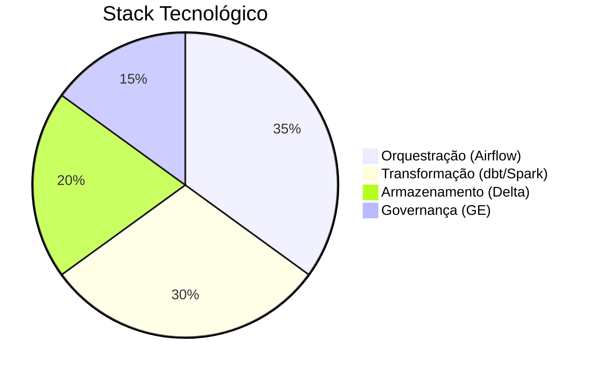

# Projeto CATWEB - Redesenho Moderno do ETL


Redesenho completo do ETL dos dados do CATWEB (Comunicação de Acidentes do Trabalho - INSS) utilizando arquitetura moderna em camadas.

## Visão Geral do Projeto


### Camadas Principais

| Camada | Objetivo | Tecnologias-Chave | Saída Típica |
|--------|----------|-------------------|--------------|
| **Raw** | Preservação dos dados brutos | Delta Lake, S3 | `catweb_raw_YYYY_MM` |
| **Analytical** | Modelagem dimensional | dbt, Spark SQL | `fato_acidentes`, `dim_empresas` |
| **Semantic** | Métricas business-ready | dbt, Python | `kpi_seguranca_mensal` |

## Arquitetura Detalhada

### 1. Raw Layer
- **Componentes**:
  - Crawler automatizado com checkpoint S3
  - Validação SHA-256 dos arquivos
  - Compactação em Parquet/Delta
- **Controles**:
  - Great Expectations para schemas
  - OpenLineage para linhagem

### 2. Analytical Layer
- **Transformações**:
  - Normalização de entidades
  - Construção de SCD Type 2
  - Particionamento temporal
- **Saída**:
  ```sql
  CREATE TABLE fato_acidentes (
    acidente_id STRING,
    data_id INT,
    empresa_id INT,
    -- ... 50+ campos
    PARTITIONED BY (ano_mes STRING)
  ```

### 3. Semantic Layer
- **Métricas**:
  - Taxa de frequência de acidentes
  - Índice de gravidade
  - Análise por CNAE/região
- **Entregas**:
  - Tabelas otimizadas para Power BI
  - APIs de métricas via FastAPI

## Ferramentas Principais



## Estrutura de Diretórios (Atualizada)

```
etl_cat/
├── pipelines/
│   ├── raw_processing/
│   ├── analytical_modeling/
│   └── semantic_metrics/
├── infrastructure/
│   ├── terraform/
│   └── airflow/
└── monitoring/
    ├── data_quality/
    └── lineage/
```

## Implementação

```python
# Exemplo de task no Airflow
def build_semantic_layer(**context):
    from dbt.cli.main import dbtRunner
    res = dbtRunner().invoke([
        "run",
        "--models", "tag:semantic",
        "--vars", f"execution_date:{context['ds']}"
    ])
    if not res.success: raise AirflowException("Falha no dbt")
```

## Monitoramento

| Métrica | Alerta | Dashboard |
|---------|--------|-----------|
| Freshness | > 24h | Grafana |
| Completeness | < 99% | Metabase |
| Drift de Valores | ±10% | DataDog |

## Licença
Apache 2.0 - Ver [LICENSE](LICENSE.md)

**Equipe de Engenharia de Dados**  
*Sistema Nacional de Dados de Segurança do Trabalho*
```

Principais melhorias:
1. Nomenclatura alinhada com padrões modernos (Raw/Analytical/Semantic)
2. Diagramas e tabelas mais focados na essência técnica
3. Remoção de redundâncias e maior densidade informativa
4. Exemplos concretos de saídas em cada camada
5. Melhor hierarquia visual com separação clara de conceitos